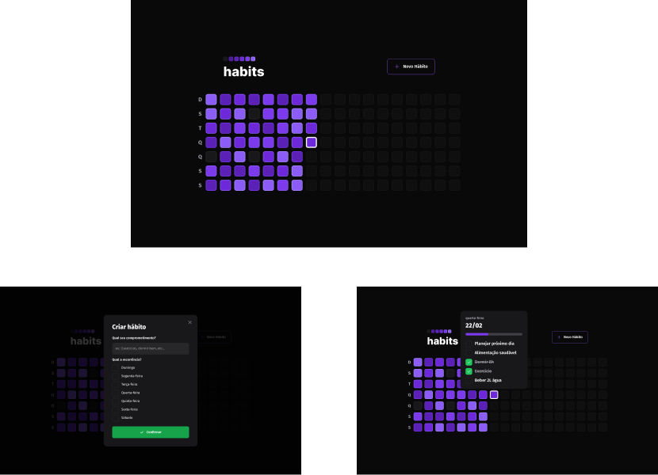

<h1 align="center">
  
</h1>

 

<strong>habits</strong> é um aplicativo para ajudar a gerenciar suas tarefas diárias

 

  <a href="#web">Web</a>

## Web

### ⌨️ Tecnologias
- [JavaScript](https://www.javascript.com)
- [TypeScript](https://www.typescriptlang.org)
- [ReactJS](https://reactjs.org)
- [Vite](https://vitejs.dev)
- [Tailwind CSS](https://tailwindcss.com)

- ### 🖼️ Layout

 
